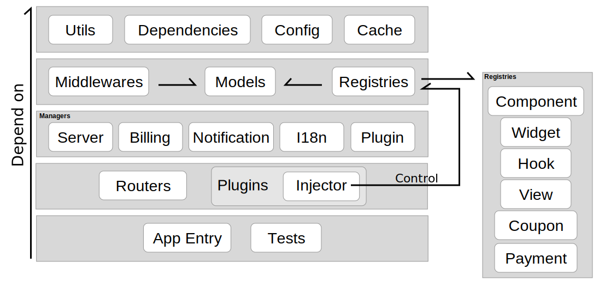

RootPanel 的结构分为五个层次，靠下的层次依赖于靠上的层次。

## 基础设施

* Dependencies: Node.js 依赖
* Utils `/core/utils`: 工具函数
* Config `/config`: 配置文件
* Cache `/core/cache`: 缓存
* Middlewares `/core/middlewate`: 路由中间件

## 数据模型（Model）

RootPanel 使用 Mabolo 管理数据模型。

* Models `/core/model`: 数据模型

    * Account: 用户
    * Component: 元件
    * CouponCode: 兑换券
    * Financials: 财务记录
    * Notification: 通知
    * SecurityLog: 安全日志
    * Ticket: 工单

## 拓展注册器（Registry）

每个 Registry 管理 RootPanel 中的一类可供拓展的功能。

* Registries `/core/registry`: 拓展注册器

    * Component: 元件类型，具体服务，如 VPN
    * CouponType: 兑换券类型，如现金、流量
    * Hook: 钩子，简单的不足以单独成为 Registry 的拓展点
    * PaymentProvider: 支付渠道，如 Paypal, 比特币
    * View: 通过 Jade 来修改页面 HTML 结构
    * Widget: 位于用户面板上交互部件

## 核心管理器（Manger）

每个 Manager 管理 RootPanel 中的一类概念。

* Server: 管理提供元件的服务器节点
* Billing: 管理付费计划、进行计费
* Notification: 管理通知
* I18n: 管理翻译和时区
* Plugin: 管理用于拓展的插件

## 插件（Plugin）

每个插件即为导出一个类的 Node Package, PluginManager 会用一个 Injector 作为参数调用插件的构造函数。Injector 是插件的私有组成部分，插件使用它与拓展注册器交互，拓展 RootPanel 核心的功能。

## 应用入口

* Routers `/core/router`: 路由
* Root `/core/root` 全局对象 `root`
* App Entry `/app`: 入口点
* Tests `/core/test`: 自动测试
